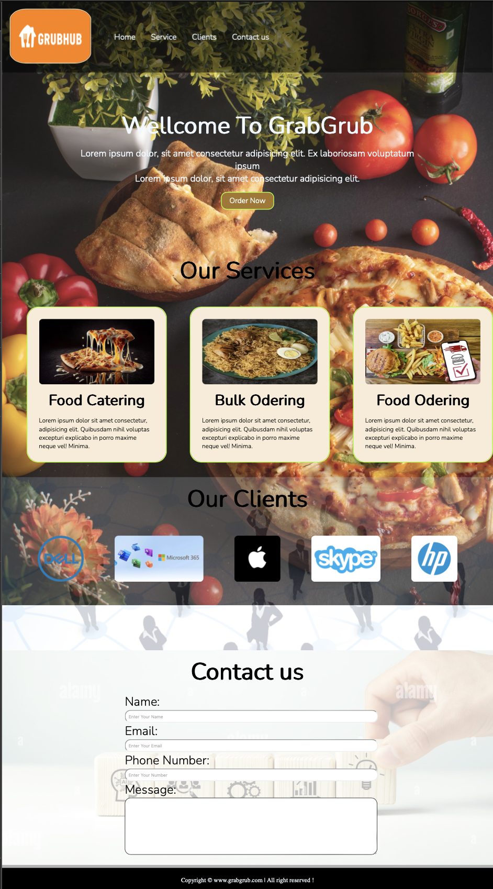

# MyOnlineMeal.com

## Description

MyOnlineMeal.com is a simple front-end web development project showcasing a fictional online food delivery service. It includes sections for home, services, client testimonials, and a contact form.

## Table of Contents

- [Screenshots](#screenshots)
- [Features](#features)
- [Technologies Used](#technologies-used)
- [Setup Instructions](#setup-instructions)
- [License](#license)

## Screenshots

## Features

- Responsive design suitable for various devices.
- Navigation menu with smooth scrolling.
- Sections for showcasing services, client logos, and contact form.
- Use of background images to enhance visual appeal.
- Use of Google Fonts for typography.
- Contact form for user interaction.

## Technologies Used

- HTML
- CSS
- Responsive design techniques
- Google Fonts

## Setup Instructions

1. Clone the repository: git clone https://github.com/CodeNobility/MyOnlineMeal.git

2. Navigate to the project directory: cd MyOnlineMeal

3. Open `index.html` in your preferred web browser to view the website locally.

